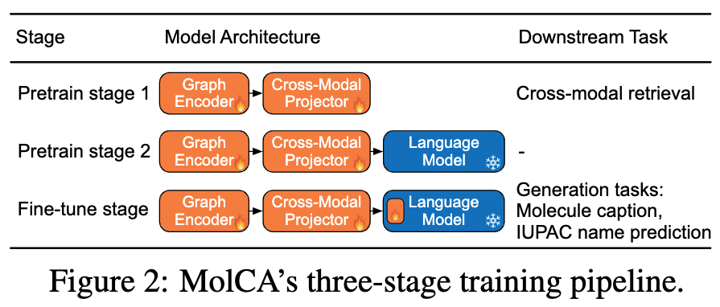
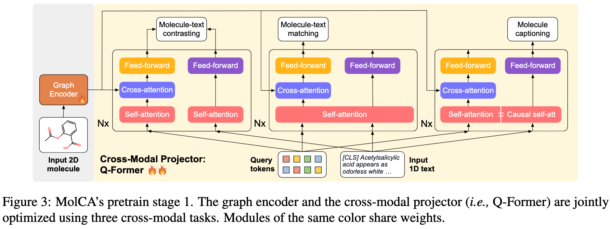
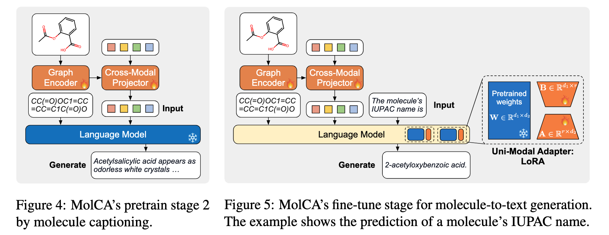

# MolCA: Molecular Graph-Language Modeling with Cross-Modal Projector and Uni-Modal Adapter

Codes of our EMNLP2023 paper. [[Paper Link](https://openreview.net/forum?id=14WRhMNq7H)]

Authors: Zhiyuan Liu, Sihang Li, Yanchen Luo, Hao Fei, Yixin Cao, Kenji Kawaguchi, Xiang Wang, Tat-Seng Chua


<p align="center">
  
</p>





## Requirements

See `environment.yml`. Run the following command to create a new anaconda environment `molca`: 

```bash
conda env create -f environment.yml
```

## Dataset

* **PubChem324k**. Download the dataset from [link](https://huggingface.co/datasets/acharkq/PubChem324k), and unzip it under the `./data/` directory.
* **CheBI-20, KV-PLM, and MoMu.** Unzip the `./dataset.zip` under the `./data/` directory. 


## Reproduce the results

### Training the Model from Scratch

**Pretrain Stage 1.** Run the following script for stage 1 pretraining on the PubChem324k dataset:

```bash
python stage1.py --root 'data/PubChem324k' --gtm --lm --devices '0,1' --mode train --filename stage1 --rerank_cand_num 128 --num_query_token 8 --tune_gnn
```

**Pretrain Stage 2.** Run the following script for stage 2 pretraining on the PubChem324k dataset:

```bash
python stage2.py --root 'data/PubChem324k' --devices '0,1' --filename "stage2" --stage1_path "all_checkpoints/stage1/last.ckpt" --opt_model 'facebook/galactica-1.3b' --max_epochs 10 --mode pretrain --prompt '[START_I_SMILES]{}[END_I_SMILES].' --tune_gnn --llm_tune freeze --inference_batch_size 4
```

**Fine-tune Stage.** Run the following script for fine-tuning on the PubChem324k dataset:

```bash
python stage2.py --root 'data/PubChem324k' --devices '0,1' --filename "ft_pubchem324k" --stage2_path "all_checkpoints/stage2/last.ckpt" --opt_model 'facebook/galactica-1.3b' --max_epochs 100 --mode ft --prompt '[START_I_SMILES]{}[END_I_SMILES]. ' --tune_gnn --llm_tune lora --inference_batch_size 8
```


### Evaluation on Our Pretrained Checkpoints 

We share the checkpoints for reproducing results of molecule-text retrieval and for reproducing results of molecue captioning on the CheBI-20 dataset.

Please download the checkpoint from this [link](https://ufile.io/6vffm5bg) and unzip it under the `./all_checkpoints` directory.

**Molecule-Text Retrieval for PCDes.** Run the following script for evaluation on the PCDes dataset.

```bash
python stage1.py --root 'data/kv_data' --gtm --lm --devices '0,1'  --filename pcdes_evaluation --init_checkpoint "all_checkpoints/share/stage1.ckpt" --rerank_cand_num 128 --num_query_token 8 --match_batch_size 64 --mode eval
```

**Molecule-Text Retrieval for MoMu.** Run the following script for evaluation on the MoMu dataset.

```bash
python stage1.py --root 'data/kv_data' --gtm --lm --devices '0,1'  --filename momu_evaluation --init_checkpoint "all_checkpoints/share/stage1.ckpt" --rerank_cand_num 128 --num_query_token 8 --match_batch_size 64 --mode eval --use_phy_eval
```

**Molecule Captioning.** Run the following script for evaluation on the CheBI-20 dataset.

```bash
python stage2.py --devices '[0]' --filename chebi_evaluation --stage2_path "all_checkpoints/share/chebi.ckpt" --opt_model 'facebook/galactica-1.3b' --mode eval --prompt '[START_I_SMILES]{}[END_I_SMILES]. ' --tune_gnn --llm_tune lora --inference_batch_size 8 --root "data/ChEBI-20_data" --peft_dir "all_checkpoints/share/chebi_lora" --init_checkpoint all_checkpoints/share/chebi.ckpt;
```

## Citation

If you use our codes or checkpoints, please cite our paper:

```bib
@inproceedings{liu2023molca,
    title={MolCA: Molecular Graph-Language Modeling with Cross-Modal Projector and Uni-Modal Adapter},
    author={Liu, Zhiyuan and Li, Sihang and Luo, Yanchen and Fei, Hao and Cao, Yixin and Kawaguchi, Kenji and Wang, Xiang and Chua, Tat-Seng},
    booktitle={EMNLP},
    year={2023},
    url={https://openreview.net/forum?id=14WRhMNq7H}
}
```